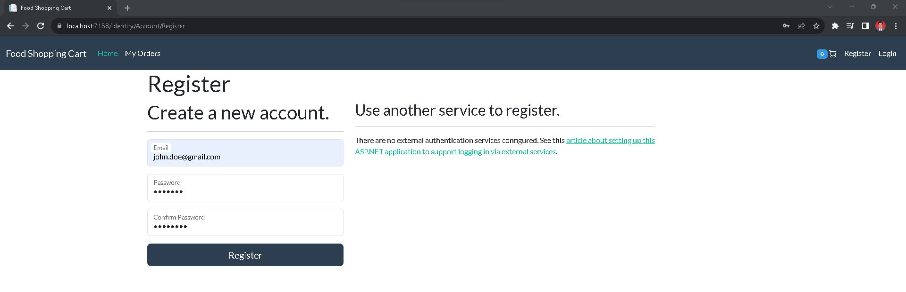
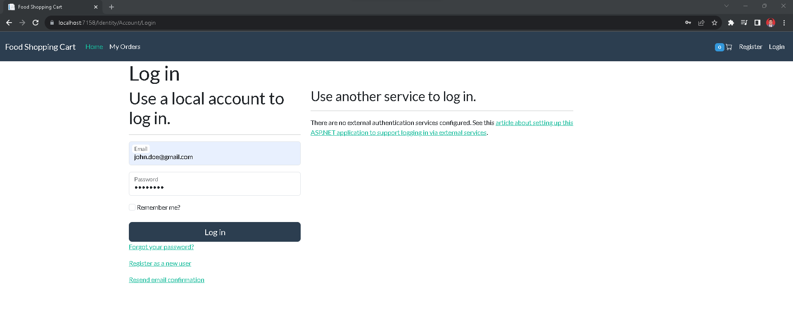
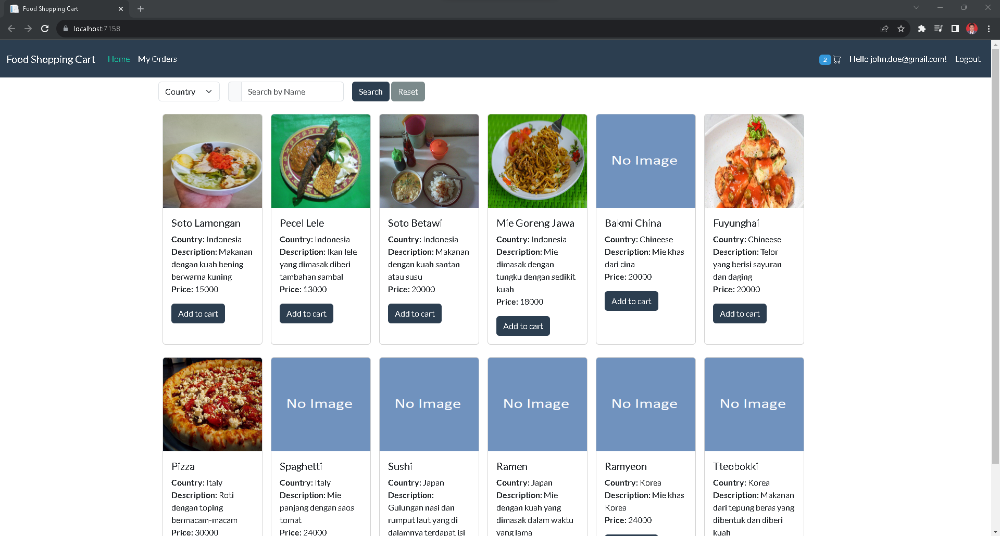
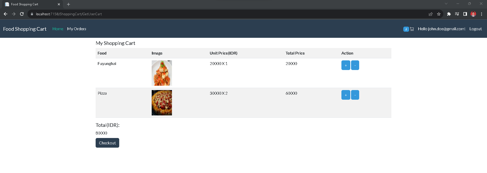
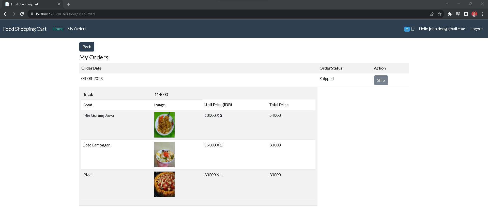
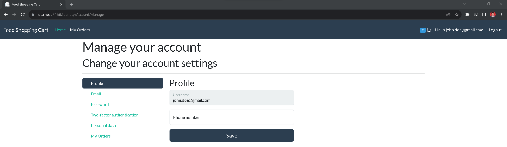

# Simple Food Shopping Cart with .NET 7

## About
Simple Food Shopping Cart application using .NET 7. For database using SQL Server 2022 . 

## Overview
This simple food shopping cart application using .NET 7, scaffolding, entity framework core, bootstrap 5, and SQL Server for the database.

## Composition
There is Solution application and db_script.sql for restore database and data.

## Login
For login after restore database. We can use
1. john.doe@gmail.com : User123!
2. admin@gmail.com : Admin123!

## Features
The simple features:
1. Registration 

2. Login

3. Home with Search and Add to cart

4. Checkout

5. Orders

6. User Management from scaffolding
